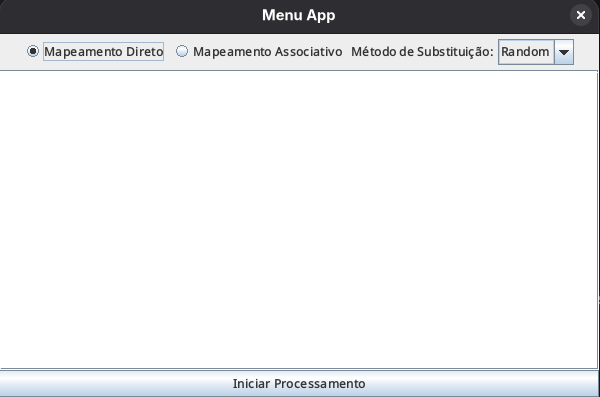
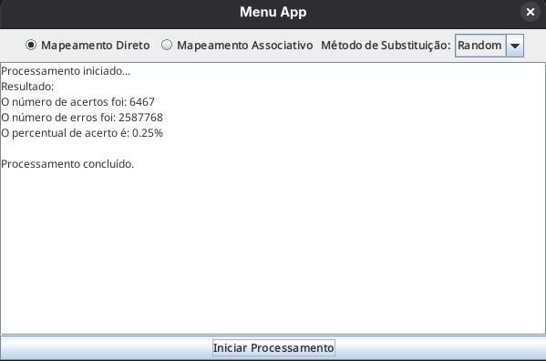

# Simulador de memória cache #


> Este projeto foi desenvolvido como parte da disciplina de **Organização e Arquitetura de Computadores**. Trata-se de uma aplicação em Java que simula o comportamento de uma memória Cache, permitindo a análise de desempenho (taxa de acertos e erros) através de diferentes tipos de mapeamento e políticas de substituição.

<div align="center">
  <table>
    <tr>
      <td align="center">
        
        <br>
        <sub><b>Menu Inicial</b></sub>
      </td>
      <td align="center">
        
        <br>
        <sub><b>Aplicação rodando</b></sub>
      </td>
    </tr>
  </table>
</div>

## Sobre o Projeto

O simulador suporta as seguintes configurações e algoritmos:

* **Mapeamentos:**
    * **Direto:** Cada bloco da memória principal é mapeado para uma linha específica da cache.
    * **Associativo:** Um bloco da memória principal pode ser carregado em qualquer linha da cache.

* **Políticas de Substituição (para Mapeamento Associativo):**
    * **FIFO (First-In, First-Out):** Substitui o bloco que entrou primeiro na cache.
    * **LFU (Least Frequently Used):** Substitui o bloco menos frequentementer acessado.
    * **LRU (Least Recently Used):** Substitui o bloco que não é usado há mais tempo.
    * **Random:** Escolhe um bloco aleatório para substituição.

## Ferramentas Utilizadas

- Java
- Java Swing

## Executando o Projeto

Siga as instruções abaixo para executar o projeto em seu ambiente local:

1. **Clone o repositório:**

   ```
   git clone https://github.com/oleandrobalbino/memoria-cache.git
   ```

2. **Navegue até o diretório do projeto:**

   ```
   cd memoria-cache
   ```

3. **Compile os arquivos:**

   ```
   javac *.java
   ```

4. **Execute o arquivo:**

   ```
   java Menu
   ```

## Autor

- Leandro Balbino
